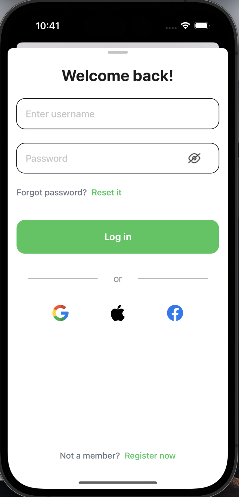
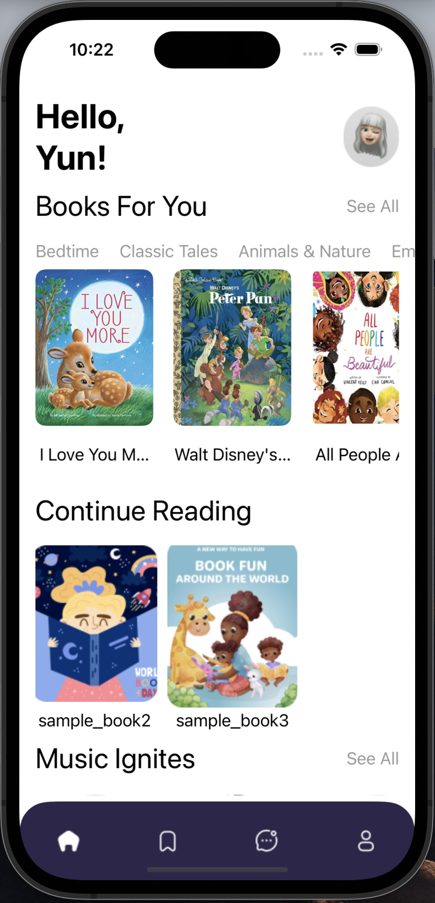
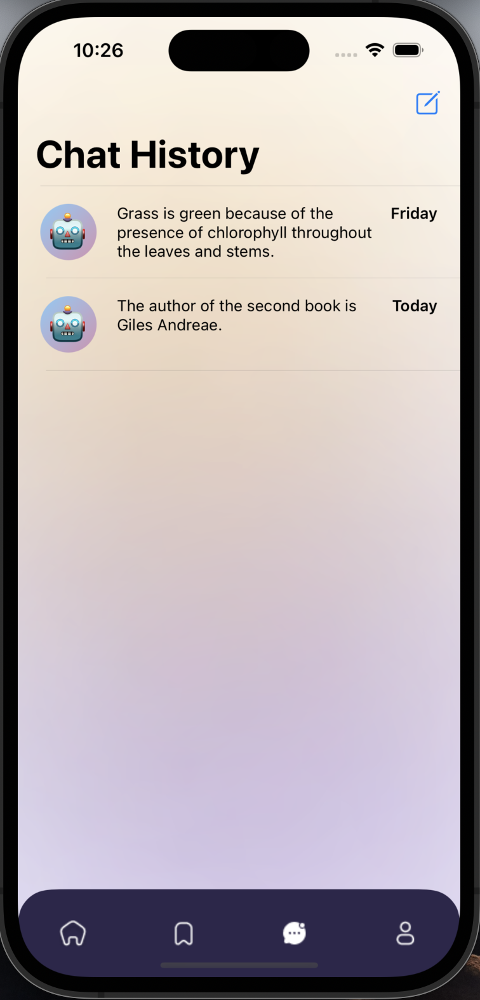
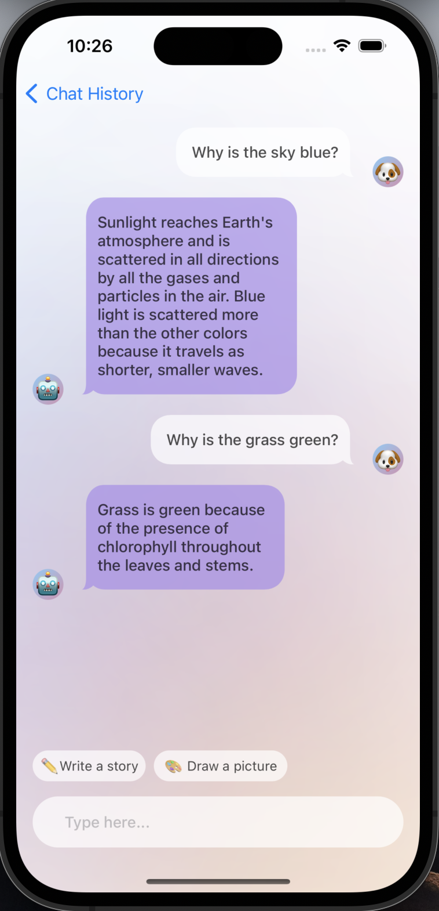
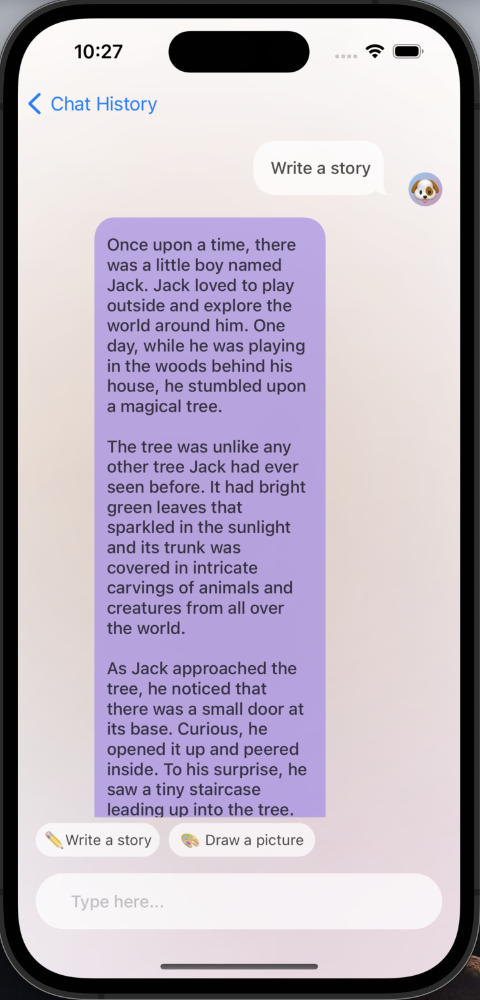
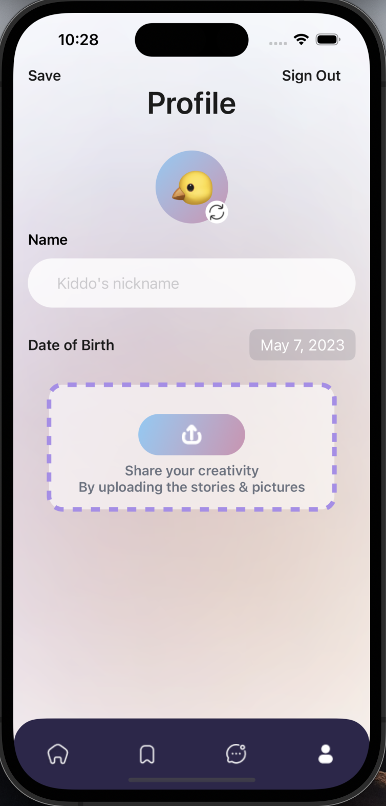

# children-handbook-gpt-powered

## iOS App

Our app is for parents to showcase fairytales to their children. We hope to provide a platform for parents to find books for their kids, bookmark them so they can come back for them later, and read them to their children. We also hope to provide a platform for parents to create their own stories and share them with other parents.

We integrated Google OAuth with Firebase into our app so that parents can log in with their Google accounts and save their favorite stories to their accounts, and we integrated ChatGPT into our app so that parents ask for story recommendations based on their children's interests as well as search for questions that they are not sure on the fly.

To do so, we built the following pages.

## Setting Up

We followed standard development practice by storing third party API keys in a separate file that is in .gitignore. In order for the App to be fully functional, please feel free to download the Config.swfit file [here](https://drive.google.com/file/d/18YMqIVPKbbtKqe1bapa2hPibzbiar7Aa/view?usp=sharing) and add it to the project root directory.

### Login / Sign Up Page

This page allows users to log in with their Google accounts. We used Google OAuth with Firebase to authenticate users and save their favorite stories to their accounts.

_Unfinished_: For Google Login, we encountered issues to reset UserDefaults. It may take a couple of times in order for sign in function to work. We plan to implement Apple Login and FaceBook Login, which required developer account.

Login page:

Sign out functionality is enabled in the Profile page below.

### Home Page

We called it `DiscoverView.swift` in our app. This page allows users to search for stories based on their children's interests. If the users are logged in and have a reading history, we will show a "Continue Reading" section for them (only used mock data for now). They will also be able to check out music for their kids.

_Unfinished_: In this section, the user should also be able to bookmark books and musics, so they can come back to them later in the bookmark page below.

### Bookmark Page

_Unfinished_.

What should happen here is that users can see their bookmarked stories and read them to their children, as mentioned above.

### Chat Page

_Please refer to Setting Up section above to get ChatGPT connected_.

We called it `ChatgptView.swift` in our app. This page allows users to chat with ChatGPT. We used OpenAI's ChatGPT to generate responses to users' questions. It features the original ChatGPT experience - ask the AI anytime, and it will provide a response. You can also create new chats and delete chats to categorize your conversations.

We created shortcut questions for the users to ask, such as "Write a story", to allow the anxious parents to get a handy solution when caring for their children.

### Profile Page

This page allows users to log out of their accounts. They can also change their preferred name and avatar here for social purposes.

_Unfinished_: meet and have a chat with other parents.

### References

During the development process, we consulted the following resources to integrate ChatGPT and Google OAuth into our iOS app:

- [OpenAI tutorial](https://youtu.be/XF8IbrNh7E0)
- [Google OAuth tutorial](https://youtu.be/M5LiqOBDeGg)

## Backend

- Routes
  - GET /api/books/ : get all books
  - GET /api/books/<int:book_id>/ : get a book by id
  - GET /api/music/ : get all musics
  - GET /api/music/<int:music_id>/ : get an music by id
  - GET /api/users/ : get all users
  - GET /api/users/<int:user_id>/ : get a user by id
  - GET /api/messages/ : get all messages
  - GET /api/messages/<int:message_id>/ : get a message by id
  - POST /api/books/ : create a book
  - POST /api/music/ : create an music
  - POST /api/users/ : create a user
  - POST /api/messages/<int:user_id>/ : create a message
  - DELETE /api/books/<int:book_id>/ : Delete a book by id
  - DELETE /api/music/<int:music_id>/ : Delete a music by id
  - DELETE /api/users/<int:user_id>/ : Delete a user by id
  - DELETE /api/messages/<int:message_id>/ : Delete a message by id
  - POST /api/save/<int:user_id>/<int:book_id>/ : Save a book for a user, according to their respective ID
  - POST /api/continue/<int:user_id>/<int:book_id>/ : Mark a book as continue reading for a user, according to their respective ID
  - POST /upload/ : Endpoint for uploading an image to AWS given its base64 form, then storing/returning the URL of that image
- Database Models
  - Asset : Asset Model
  - Book : AudioBook Model
  - Music : Music Model
  - User : User Model
  - Message : Message Model
